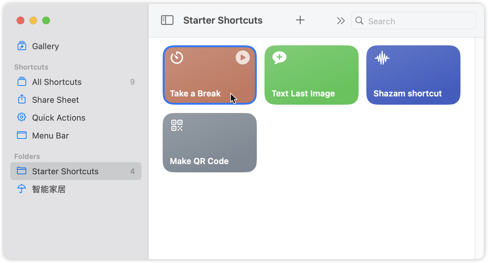
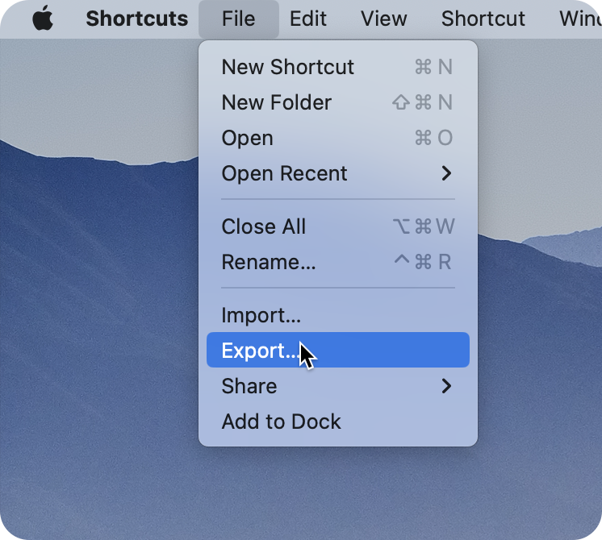
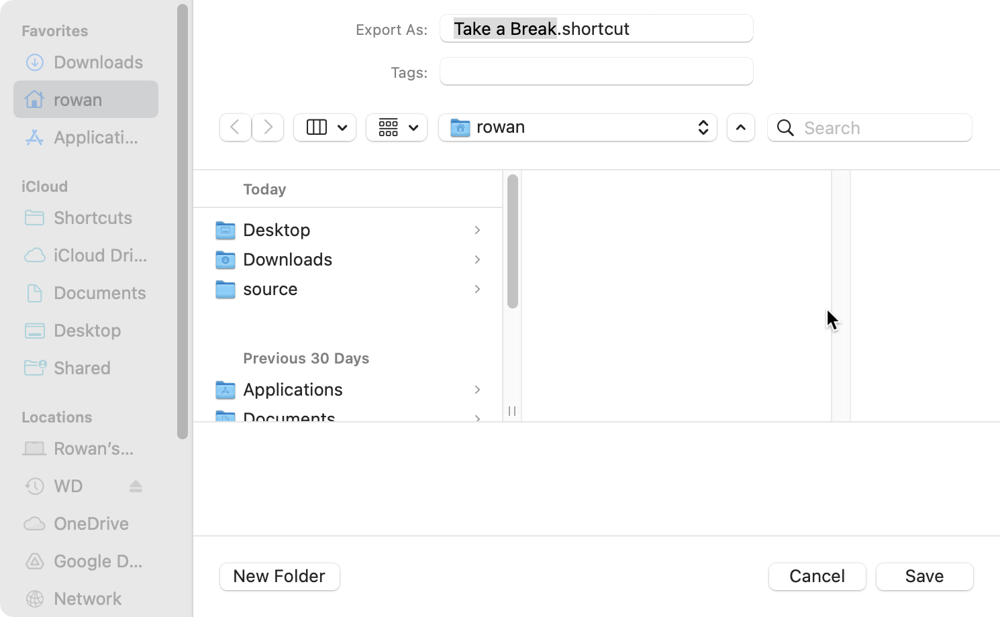

# Shortcuts 🍎

Apple platform shortcuts collection.
Welcome to contribute! 🎉

- [Shortcuts 🍎](#shortcuts-)
  - [Table of Contents](#table-of-contents)
  - [Contributor Guide](#contributor-guide)

## Table of Contents

| Shortcut Name               | Description | Author                              | Version | iCloud Link                                                                      | File Link                                                   | Last Updated |
| --------------------------- | ----------- | ----------------------------------- | ------- | -------------------------------------------------------------------------------- | ----------------------------------------------------------- | ------------ |
| Get Hash from Selected File | as title    | [@ViGeng](https://github.com/ViGeng) | 1.0     | [iCloud Link](https://www.icloud.com/shortcuts/2d7c4caee1e043109c187fa757017e24) | [File Link](shortcuts/Get Hash from Selected File.shortcut) | 2024-04-01   |
| Save Screenshot to Photo Album | screenshot and save to album   | [@ViGeng](https://github.com/ViGeng) | 1.0     | [iCloud Link](https://www.icloud.com/shortcuts/67aa8b84140242e082fccfe02cc9c033) | [File Link](shortcuts/Save Screenshot to Photo Album.shortcut) | 2024-04-01   |
| Extract Subject from Clipboard | screenshot and save to album   | [@ViGeng](https://github.com/ViGeng) | 1.0     | [iCloud Link](https://www.icloud.com/shortcuts/f5e8c7c837274576846e5c0b05653a25) | [File Link](shortcuts/Extract Subject from Clipboard.shortcut) | 2024-04-01   |

## Contributor Guide

[Apple Official Shortcuts Sharing instructions](https://support.apple.com/guide/shortcuts-mac/apdf01f8c054/mac)

Expand to see detailed screenshot guide!

1. select the shortcut you want to share
   
2. open `File` menu on the menu bar (top left corner) and select `Export...`
   
3. Choose your target path and remember to select the `For:` as Anyone
    
    
4. Click `Save` and you will get a `.shortcut` file
5. Finally, you can share the `.shortcut` file to others

